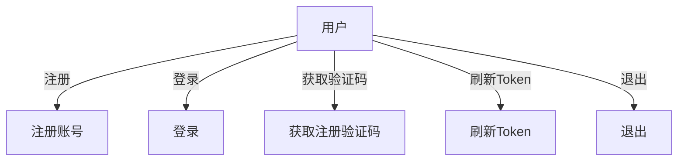
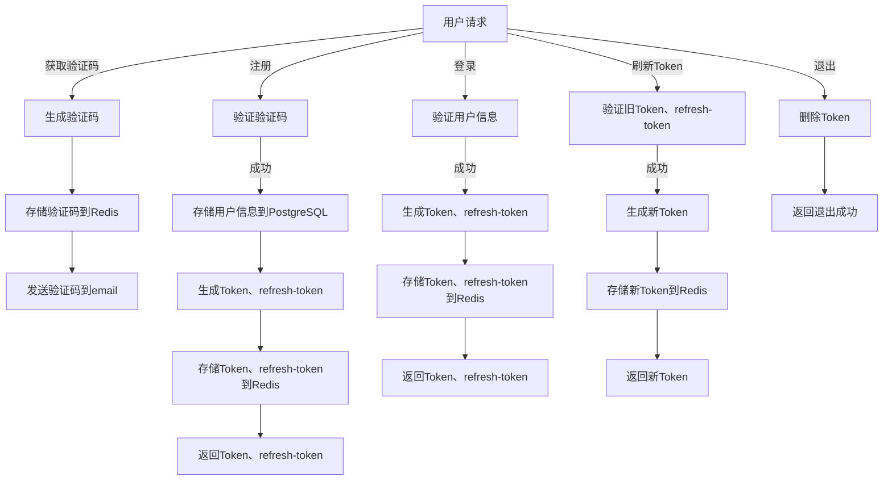
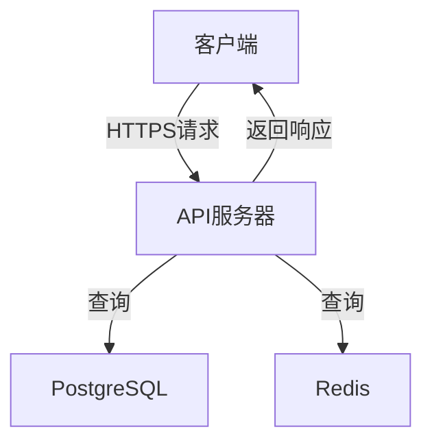

[toc]

## 请求规范

需要鉴权的 API 务必在请求头中附带 token 信息。
格式如下:
```
Authorization: <认证方案> <凭证信息>
```
暂使用`Customize`
## 返回规范

```json
{
  "res": {
    // response json
  },
  "err-msg": "error message outline",
  "err-msg-details":"error message details",
  "err-code": "code number"
}
```

## 获取注册验证码

**POST**: `/api/v1/auth/captcha`

**参数**:

```json
{
  "type": "email",
  "account": "your account"
}
```

**返回**:
将会通过email发送captcha
```json
{
  "res": {
  },
  "err-msg": "",
  "err-code": ""
}
```

## 注册账号

**POST**: `/api/v1/auth/register`

**参数**:

```json
{
  "type": "email",
  "account": "your account",
  "psw": "password",
  "captcha": "captcha code"
}
```

**返回**:

```json
{
  "res": {
    "user-id": "user identifier",
    "token": "authentication token",
    "refresh-token":""
  },
  "err-msg": "",
  "err-code": ""
}
```

## 登陆

**POST**: `/api/v1/auth/login`

**参数**:

```json
{
  "type": "email",
  "account": "your account",
  "psw": "password"
}
```

**返回**:

```json
{
  "res": {
    "token": "authentication token",
    "user-id": "user identifier",
    "refresh-token":""
  },
  "err-msg": "",
  "err-code": ""
}
```

## 刷新 Token

**POST**: `/api/v1/auth/refresh-token`

**请求头**:

```
Authorization: Customize <token>
```
**参数**
```json
{
  "refresh_token":""
}
```
**返回**:

```json
{
  "res": {
    "token": "new authentication token"
  },
  "err-msg": "",
  "err-code": ""
}
```

## 退出

**GET**: `/api/v1/auth/logout`

**请求头**:

```
Authorization: Customize <token>
```

**返回**:

```json
{
  "res": {
    "message": "logout successful"
  },
  "err-msg": "",
  "err-code": ""
}
```


## Redis

- auth:email2captcha:<$email> -> captcha
- auth:token2userid:<$token> -> user_id
- auth:userid2token:<$userid> -> token
- auth:refresh_token2userid:<$refresh_token> -> user_id
- auth:userid2refresh_token:<$userid> -> refresh_token

## 图例
### 功能图

### 流程图

## 架构图



